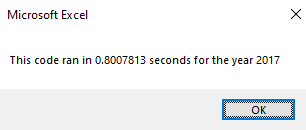
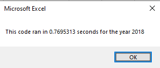
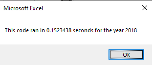
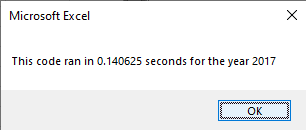

# stock-analysis
## Overview of Project
### File in this repository provides an analysis of multiples stocks for 2017 and 2018 including total daily volumes for every ticker, and finally give them result of return percentage, also give us an example of refactroring code allowing you to identify main pro and cons for this code. 

## Results 
### the results reduce in good way the script run time for the analysis from ~ 0.8 to ~ 0.15 seconds with improvements in the hard code, in this way we discover how we can design new code base on performance execution. 

#### The followin images shows in the first two images the execution time before the improvements in the new code desing close to 0.8 seconds

#### After new code desing rub excutution time show improvement for almost 0.6 seconds

## Summary
### What are the advantages or disadvantages of refactoring code?
#### the advantages are in the run time execution and the knowledge for scripting skills thinking on the best performance, easy to read and shows a good structure, some disadvanteages the thinking way to desing it take extra time to understand  the way to structure the code.
### How do these pros and cons apply to refactoring the original VBA script?
#### after perform the first strucutre the way to increase data in the format could be easy.

